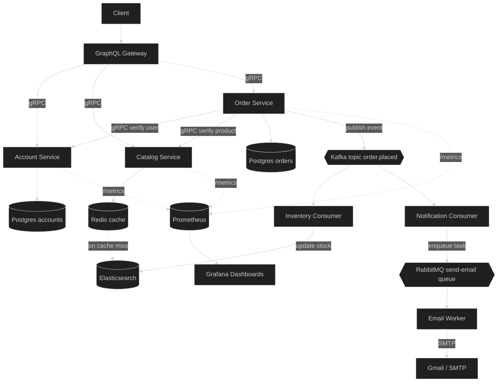

# Go gRPC GraphQL Microservices

> A service-oriented e-commerce backend built with Go, gRPC, GraphQL, and independently owned data stores.

It is being rebuilt and extended as a practical microservices system: GraphQL provides one client-friendly API, while each business capability runs as an independently deployable Go service.

## What we are building

We are building the backend for a small e-commerce platform with three core domains:

- **Accounts** — create and retrieve customers.
- **Catalog** — manage and search products.
- **Orders** — create orders for an account, validate products, and calculate totals.

The system deliberately separates business ownership. An account service owns account data; a catalog service owns product data; and an order service owns order data. Services do not reach into one another’s databases. They communicate through explicit gRPC contracts.

GraphQL acts as the system’s API gateway. It translates client queries and mutations into gRPC calls and combines responses when a request crosses service boundaries. This keeps the public API convenient without coupling clients to internal service implementations.

## Architecture



## Request flow

### Reading data

1. A client sends a GraphQL query to the gateway.
2. The gateway calls the appropriate service over gRPC.
3. The service reads from its own datastore, using Redis to accelerate catalog reads.
4. The gateway maps the gRPC response into the GraphQL response shape.

For example, a `products` query is handled by the catalog service. A cache hit returns quickly from Redis; a cache miss reads from Elasticsearch and can then refresh the cache.

### Creating an order

1. The client submits `createOrder` through GraphQL.
2. The gateway calls the order service.
3. The order service verifies the account through the account service.
4. It verifies the requested products and prices through the catalog service.
5. It calculates the order total and persists the order in PostgreSQL.
6. It publishes an `order.placed` event to Kafka.
7. An inventory consumer updates product stock.
8. A notification consumer places an email task on RabbitMQ.
9. The email worker sends the notification through Gmail/SMTP.

The order request is synchronous where the caller needs an immediate answer. Inventory and email processing are asynchronous so those side effects do not unnecessarily delay order creation.

## Service responsibilities

| Component | Responsibility | Data/API boundary |
| --- | --- | --- |
| GraphQL Gateway | Public API, validation, response composition | GraphQL over HTTP; gRPC clients internally |
| Account Service | Account creation and account lookup | Account gRPC API; PostgreSQL accounts |
| Catalog Service | Product CRUD, search, pagination, and stock data | Catalog gRPC API; Redis and Elasticsearch |
| Order Service | Order creation, totals, and order history | Order gRPC API; PostgreSQL orders |
| Inventory Consumer | React to placed orders and update stock | Kafka consumer; catalog/index update |
| Notification Consumer | Turn order events into email tasks | Kafka consumer; RabbitMQ producer |
| Email Worker | Deliver queued email notifications | RabbitMQ consumer; SMTP client |
| Prometheus/Grafana | Metrics collection and dashboards | `/metrics` endpoints |

## Repository structure

```text
.
├── account/                 # Account microservice
├── catalog/                 # Catalog microservice
├── order/                   # Order microservice
├── graphql/                 # GraphQL gateway and resolvers
│   ├── cmd/main.go          # Gateway process entry point
│   ├── schema.graphql       # Public GraphQL contract
│   └── *_resolver.go        # GraphQL-to-gRPC orchestration
├── docker-compose.yaml      # Local infrastructure and services
├── go.mod
└── README.md
```

Each service folder represents a separate runtime boundary. It may live in the same repository for convenient development, but it must be buildable, testable, deployable, and restartable independently.

## Current implementation status

The repository currently contains the core synchronous order path:

- The GraphQL schema defines accounts, products, orders, pagination, and mutations.
- The gateway process is defined under `graphql/cmd` and listens on port `8080`.
- Account and catalog services provide the gRPC dependencies used by the order service.
- The order service includes its protobuf contract, gRPC server/client, PostgreSQL repository, migration, validation, and total calculation.
- The GraphQL gateway is wired to account, catalog, and order clients for the account/product queries and create mutations.

The architecture diagram describes the intended complete system. Redis, Kafka, RabbitMQ, Prometheus, Grafana, inventory processing, notifications, and the email worker are still planned platform components. The current order implementation persists a price snapshot so later catalog changes do not rewrite order history; event publishing and stock reservation remain future work.

## Design principles

- **Database ownership:** a service never reads another service’s database directly.
- **Explicit contracts:** gRPC protobuf definitions are the boundary between services.
- **Thin gateway:** GraphQL translates and composes; domain rules remain inside services.
- **Synchronous core, asynchronous side effects:** order validation and persistence happen in the request; inventory and notifications react to events.
- **Independent operation:** every microservice should have its own configuration, server lifecycle, health checks, tests, and deployable image.
- **Observable behavior:** services expose metrics so latency, errors, cache performance, and event processing can be monitored.

## Reference


- [GraphQL](https://graphql.org/)
- [gRPC](https://grpc.io/)
- [Protocol Buffers](https://protobuf.dev/)
