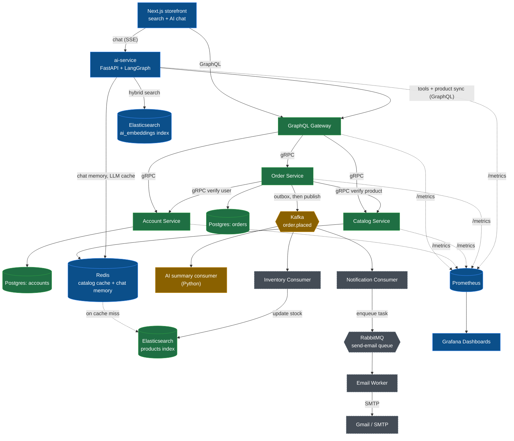
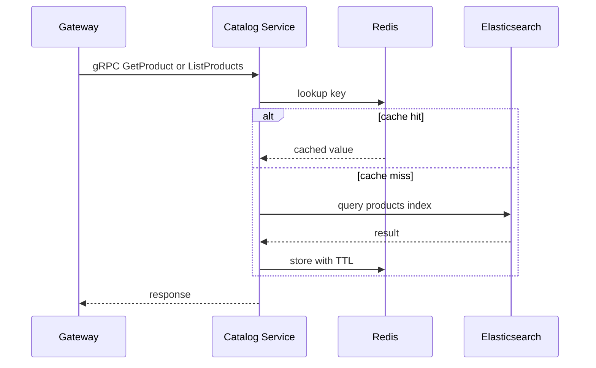
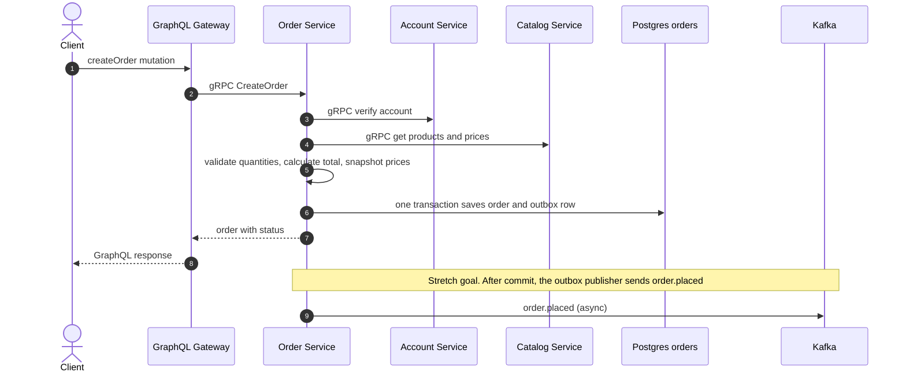
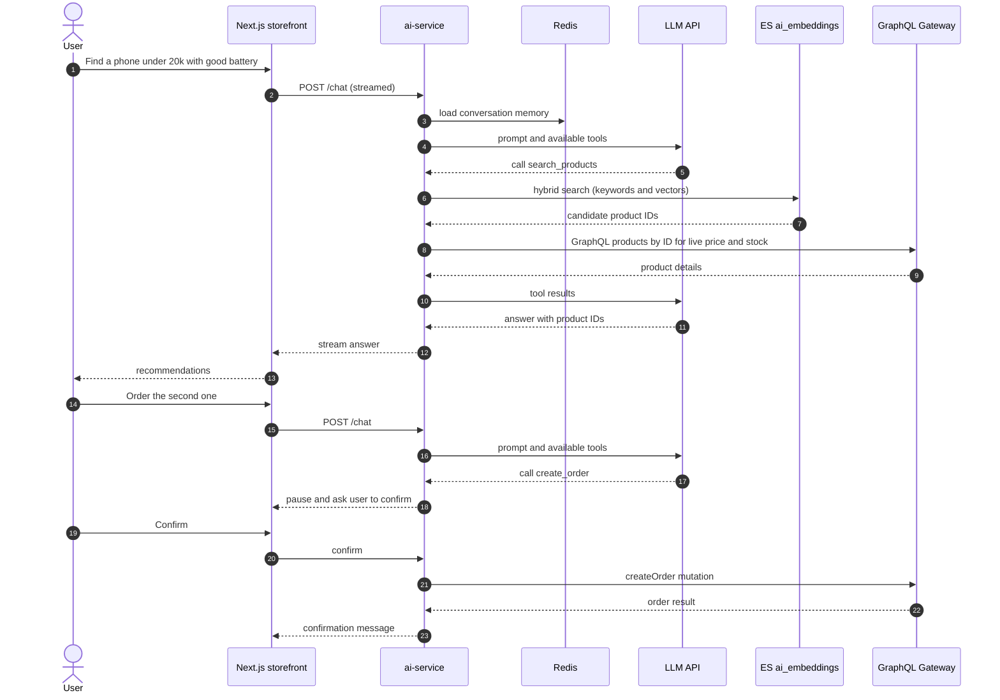
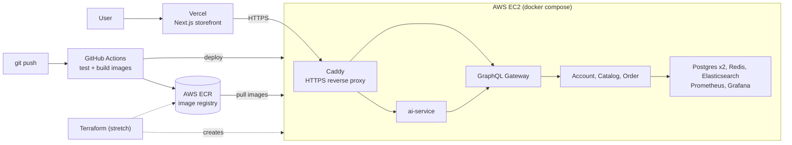

# Architecture

This document describes the target architecture of the Go gRPC GraphQL Microservices platform and how far each part has come. The diagrams use Mermaid, which GitHub renders directly.

## Legend

| Colour | Meaning |
|---|---|
| 🟩 Green | Implemented in the repository today |
| 🟦 Blue | Being built in October 2026 (core scope) |
| 🟨 Amber | October stretch goal |
| ⬜ Grey (dashed) | Planned for later (November onward) |

Update the colours in the diagram as each part ships.

## 1. System overview

## 2. What changes compared to the base repository

| Area | In the repo today | October change | How it works | Target date |
|---|---|---|---|---|
| Elasticsearch + Compose | Client and image versions can mismatch | Fix the compatibility, verify the full stack end to end | Catalog talks to Elasticsearch through the Go client, so versions must match | Oct 7 |
| Health and lifecycle | No health checks or graceful shutdown | gRPC health + readiness endpoints, Compose healthchecks, SIGTERM handling | Containers only receive traffic when ready, and finish in-flight requests when stopped | Oct 8 |
| Errors | Mixed error handling | Consistent gRPC status codes (NotFound, InvalidArgument, Unavailable, Internal) | Gateway can map each code to a clean GraphQL error | Oct 9 |
| CI | None | GitHub Actions: format, vet, test, build images, push to ECR | Every push proves the stack still builds and passes tests | Oct 9 |
| Redis | Only in the diagram | Cache-aside in the catalog service | Read: Redis hit returns fast, miss reads Elasticsearch then fills Redis with a TTL. Write: invalidate the key | Oct 10-12 |
| AWS deploy | Local only | ECR + EC2 running Docker Compose, security groups | CI pushes images, the instance pulls and runs them. Only 80/443 are public | Oct 13-14 |
| Observability | Planned | `/metrics` on every service, Prometheus, Grafana | Latency, errors, cache hit rate on one dashboard | Oct 15 |
| Search | Basic name/description search | Fuzzy match, filters, aggregations, GraphQL `search` query | Powers the storefront search page | Oct 16 |
| ai-service (new) | Does not exist | Python FastAPI + LangGraph agent + RAG | See section 5 | Oct 12-26 |
| Storefront (new) | Does not exist | Next.js: search page + streaming AI chat | Calls the gateway (GraphQL) and ai-service (streaming) | Oct 17-23 |
| HTTPS | None | Caddy reverse proxy + domain | Terminates TLS in front of the gateway and ai-service | Oct 20 |
| Order status | Not stored | Status field on orders (PENDING / CONFIRMED / FAILED / CANCELLED) | Lets the agent and clients report order state | Oct 21 |
| Outbox + Kafka | Planned | Outbox table, publisher, `order.placed` topic, a logging consumer | Order and event are saved in one transaction, so no event is lost | Oct 22-24 (stretch) |
| Stock reservation, inventory consumer, RabbitMQ, email worker, gRPC auth/TLS, tracing | Planned | Not in October | Continue in November | Later |

## 3. Reading data (catalog with Redis)

## 4. Creating an order

The synchronous part answers the caller immediately. Side effects (stock, email, AI summary) happen asynchronously from the event.

## 5. AI chat flow (ai-service)

How it works in plain words:

1. **RAG:** Product text is turned into embeddings and stored in the ai-service's own index. A question retrieves the closest products, so the model answers from real catalog data.
2. **Agent tools:** The LLM does not touch any database. It asks the ai-service to run tools (search products, get product, get order, create order). Each tool is a normal GraphQL call to the gateway.
3. **Human in the loop:** Any action that changes data (creating an order) pauses until the user confirms in the UI.
4. **Evals:** A fixed set of test conversations checks that the agent picks the right tool and answers from the catalog. The pass rate is tracked over time.

## 6. Deployment

Network rules: only ports 80 and 443 are public. SSH (22) is limited to your own IP. Databases, Redis, Elasticsearch, Prometheus and Grafana are never exposed publicly.

## 7. Design rules (extended)

The existing rules still apply. Two are added for the AI service:

- **Database ownership:** a service never reads another service's database directly.
- **Explicit contracts:** gRPC protobuf definitions are the boundary between services.
- **Thin gateway:** GraphQL translates and composes; domain rules stay inside services.
- **Synchronous core, asynchronous side effects:** order validation and persistence happen in the request; stock, email and AI summaries react to events.
- **ai-service is just another client:** it reads product and order data only through the gateway, never from the catalog or order databases.
- **ai-service owns its own index:** the embeddings live in an `ai_embeddings` index owned by the ai-service, filled from the catalog through the gateway.
- **Observable behaviour:** every service exposes `/metrics`.
